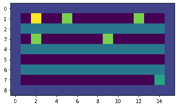
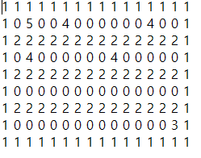

<!-- 스페이스 바 두 번 치면 한 줄 통째로 공백 생성 -->
# RL_Project

## 전체 구성
- **게임 목표**
  - Agent가 Target에 정상적으로 도달하면서 Reward 누적 합을 최대화 

- **실험 방법**
  - Value-Based RL의 대표 알고리즘인 DQN과 Policy-Based RL의 대표 알고리즘인 PPO 성능 비교
    
- **동작**
  - 동작 예시 ---->   
  - 색깔 의미 🔽  
    
| **번호**          | **수행 동작** | 
| :------------:    | :-----------: |
| 노란색             | 목표 지점     |   
| 연두색             | Cookie       |            
| 초록색             | Agent        |              
| 청록색             | 가시덤불      |    
| 보라색             | 그냥 땅       |  
| 남색               | 벽            |  

  
 
## Environment
- **Map**
  - 9x16 txt 파일 생성 후 값들을 받아 맵을 생성. 값의 의미는 다음과 같음. 
    - map.txt --> 
      
| **번호** | **의미** | **설명**                                                                                                                              |
|:--------:|:--------:|--------------------------------------------------------------------------------------------------------                               |
| **0**    | 그냥 땅   | Agent가 자유롭게 이동할 수 있는 pixel                                                                                                   |
| **1**    | 벽        | 해당 pixel을 밟을 수도, 무시하고 지나갈 수도 없음.                                                                                       |
| **2**    | 가시덤불  | 해당 pixel을 밟을 수는 있지만 즉시 음의 Reward를 받음.                                                                                   |
| **3**    | Agent    |                                                                                                                                       |
| **4**    | Cookie   | 해당 pixel에서는 양의 Reward를 받지만, 매 timestep에 -1의 Reward를 받고 있기 때문에 Cookie를 다 챙기면 오히려 전체 Reward를 낮추게 된다. |
| **5**    | 도착지점  |                                                                                                                                       |

- **State**
  - 이 Environment에서 State와 Observation은 동일한 값이다. 
  - State는 Map의 전체 값 그 자체를 받는다. 
  - ANN에 입력 시에는 Flattening 시켜서 입력으로 넣어준다. 

- **Action**
  - Agent가 할 수 있는 Action은 5가지이다. 

| **번호**          | **수행 동작** | 
| :------------:    | :-----------: |
| 0                 | 제자리 동작    |   
| 1                 | 위로 이동      |            
| 2                 | 아래로 이동    |              
| 3                 | 왼쪽으로 이동  |    
| 4                 | 오른쪽으로 이동|             

- **Reward**
  - 가시 덤불 pixel에 도달하면 -0.1의 Reward를 받는다. 
  - Cookie pixel에 도달하면 +1의 Reward를 받는다. 
  - 매 timestep에 -1의 Reward를 받는다. 
  - 목표 지점에 도달하면 100.0의 Reward를 받는다.

## 코드 실행 방법
- **gym_gridworld/env/env_gridworld.py**
  - dddd
